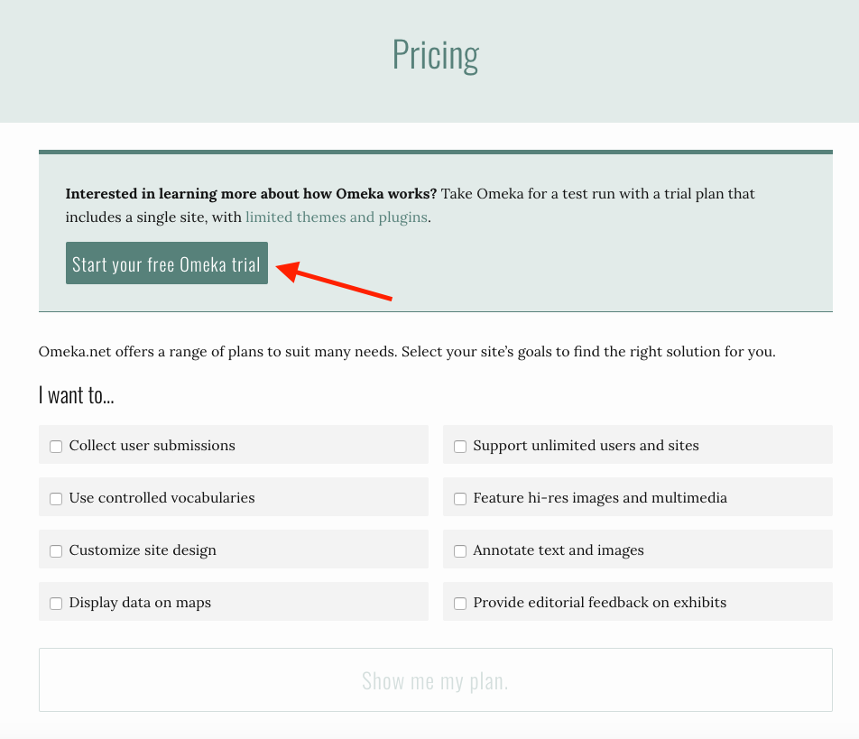

# Getting Started with Omeka.net

Omeka is a simple, free web publishing system built by and for scholars that is used by hundreds of archives, historical societies, libraries, museums, and individual researchers and teachers to create searchable online databases and scholarly online interpretations of their digital collections. If you have a digital collection of primary sources that you want to publish online in a scholarly way, you’ll want to consider Omeka.
 
For the purpose of this workshop, we are going to take Omeka for a test run by registering a free account on (http://www.omeka.net "Omeka.net").

Go to (https://www.omeka.net/signup#), and click on "Start your free Omeka trial."

Once you have filled out and submitted the form, check your email for an activation link. If you don’t get the email, check your spam folder. 

Please make sure you are able to log into your account, and that you keep login information handy in view of the workshop. 

[<<< Back](theoreticalconcerns.md) [Next >>>](createasite.md) 
