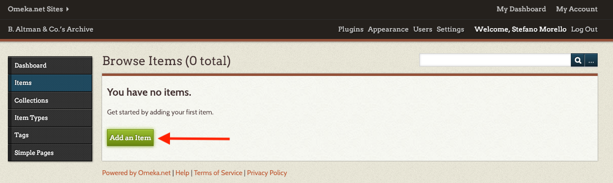
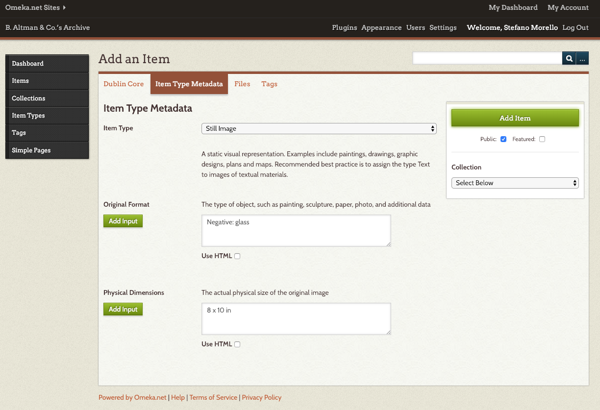

# Add an Item

An “item” is the basic unit of an Omeka site. It might be a photograph with a single attached image file, a three-page letter with three attached image files (one for each page), or a record with no attached files (such as a “person” record). Omeka can handle all the major digital file types for documents, images, audio, and video; audio and video files display as an embedded Quicktime player so that the user can listen or watch.

Let’s try and add a few items together. 

## Add a Still Image
We are going to start with a picture of the Altman & Co. headquarter on Fifth Avenue. Right click [here](1.jpg) and download the file to your desktop. 

From your site's dashboard, click on _Items_ to access the Items menu, then click on _Add an Item_.



The first thing we need to do is compile the metadata for our item. We saw that metadata is information about the item necessary to store, retrieve, and use the data in a meaningful manner. Here’s an example of how we would fill out the fields for this item.

```
Title Altman Building, New York, N.Y., ca. 1906
Subject B. Altman & Company, Department Stores
Source Detroit Publishing Co., Publisher. Altman Building, New York, N.Y. New York New York State New York. United States, ca. 1906. Photograph. https://www.loc.gov/item/2016795056/.
Publisher Detroit Publishing Co., publisher
Date 1906
Rights No known restrictions on publication.
Relation Detroit Publishing Company photograph collection (Library of Congress)
Identifier http://hdl.loc.gov/loc.pnp/det.4a1381
Coverage 365 5th Avenue, New York, NY, United States
```

On the right hand side box, you'll have the option to make the item “Public” or “Featured.” If we check the “public” box, the item will be accessible through your public facing website. Otherwise, only authorized users will be able to see it in the dashboard. On the other hand, Omeka sites by default have a space on the home page for “featured” items that are particularly interesting. You can mark items as “featured” when you add them to your database or afterwards. If you website has more than one featured item, it will load a new one randomly when the site is refreshed. 

Let’s now move on to the second tab _Item Type Metadata_.

By default Omeka offers 12 types of items, including “Document,” “Still Image,” “Sound,” “Moving Image,” “Person,” and more. You can also define custom item types, perhaps something like “Coin” or “Poem” or “Quilt,” and you can define custom sets of metadata fields to go with those item types. For instance, if you define the item type “Poem,” you might define a metadata field such as “Rhyme Scheme” where you can enter that information (such as A’bA” abA’ abA” abA’ abA” abA’A” for a villanelle). Be aware, though, that creating custom item types and metadata fields may make it more difficult to exchange data between your Omeka archive and other existing systems. 



Because our file is a "Still Image," we’ll be prompted to enter the following information:

```
Original Format: Negative: glass
Physical Dimensions: 8 x 10 in
```

The _File_ tab allows us to add one or more files to the record we are creating. In this case, we just want to upload the one picture of the Altman picture that we downloaded. 

Finally, _Tags_ allow you to link items together with terms of your choosing. When any two items have the same tag, the tag automatically turns into a link. Omeka sites allow you to browse items by tag. We are going to link together a set of items that relate to the Fifth Avenue Store, so we can use the tag “fifthavestore.”

Click on _Add Item_ to save and... congratulations! You’ve created the first item on your site! 

## Add a PDF File

Let’s now try with a PDF document. Click [here](2.pdf) and download on your desktop this advertisement for Altman & Co. ran by The Sun in the spring of 1918. 

We are going to follow the same steps as we did for the photograph of the Altman building. 

From the Items menu, click on _Add New Item_. Compile the metadata for the item as follows.

```
Title "The Question of Spring Clothes" 
Subject Spring Clothes Advertisement 
Description Newspaper Ad published on The Sun in the spring of 1918
Creator Altman & Co. 
Source Chronicling America Publisher The Sun, March 03, 1918, Page 4, Image 4 
Date March 3, 1918 
Contributor [no text] 
Rights No known restrictions on publication.
Format Newspaper 
Language English 
Identifier https://chroniclingamerica.loc.gov/lccn/sn83030431/1918-03-03/ed-1/seq-4/
Coverage 365 5th Avenue, New York, NY, United States
```

In the _Item Type Metadata_ tab, select “Text” from the dropdown menu and compile the additional metadata information for the document. Adding the transcription of your document to the "text" field, will make its content searchable through Omeka's internal search function. 

```
Text:  THE QUESTION OF SPRING CLOTHES is infinitely more momentous in times of war than In times of peace. Selections must be made with more forethought, with more discrimination, with more regard for suitability and wearing quality. Moreover, in war times women are very busy folk, with less leisure than usual to bestow upon matters of dress. With all these important details In mind, B. Altman & Co. have given even more than ordinary care to the assembling of the new things for Spring. Clothes are, if anything, rather smarter this season than last ; and the smartest of them all are ready for selection here. Women, misses, children and the tiniest folk have all been cared for; and there are, besides, just the clothes that boys and young men will want to wear, as well as the latest styles In furnishings for men. 

Original Format: Paper
```

In the _File_ tab select 2.pdf from your desktop. 

Since this ad pertains only to the store on 5th Avenue, we are also going to assign the _Tag_ fifthavestore to this item. 

Click on _Add Item_ to create your item. 

You can now try and create a few items on your own. You will find the metadata in the txt files with the name, but feel free to think through and make up your own metadata as you go. 

1. [B Altman's Logo](3.jpg) | [Metadata](3.txt)
2. [Living Room Sale](4.jpg) | [Metadata](4.txt)  
3. [White Sale Commercial](5.mp4) | [Metadata](5.txt)

[<<< Back](createasite.md) [Next >>>](collections.md)  
