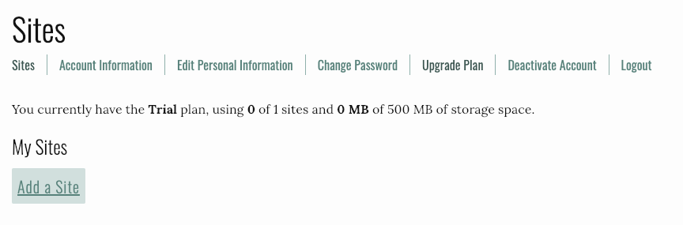
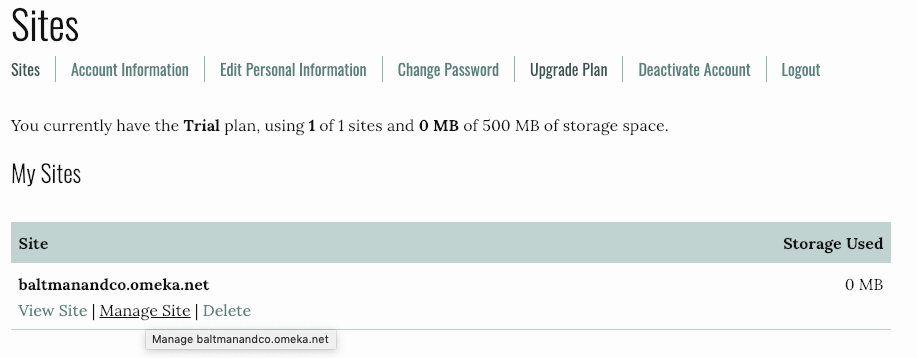
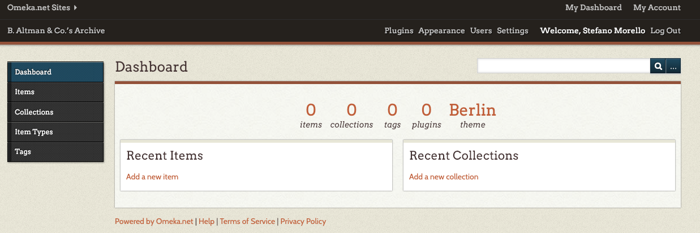

# Create an Omeka Site

Log into your Omeka.net account. From your account click on _Add a Site_. 



Give your website a subdomain name, a title, and a description. 

```
Subdomain name: baltmanandco[#].omeka.net
Site title: B. Altman & Co.’s Archive
Site description: The B. Altman & Co.’s Archive collects documents, images, videos, and other digital artifacts relevant to the history of the department store founded by Benjamin Altman in 1865 in New York City. 
```

Go back to your account and click on _Manage Site_ to access your website’s dashboard. 



Remember, only authorized users can access the backend of your site. If your site was a restaurant, this would be the kitchen. In other words, this is where you will create and organize all of the content that is presented on your site. 



You have two menus in your dashboard. One on the left that allows you to create and edit content; and one on the top, which allows you to deal with the structure of your website. Let’s begin with the latter. 

[<<< Back](omekainstall.md) [Next >>>](themesplugins.md)  
