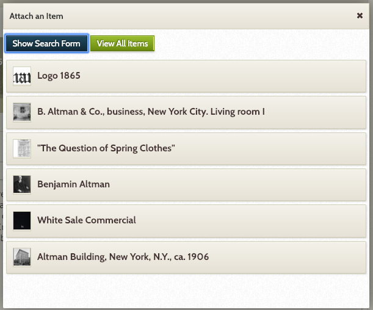
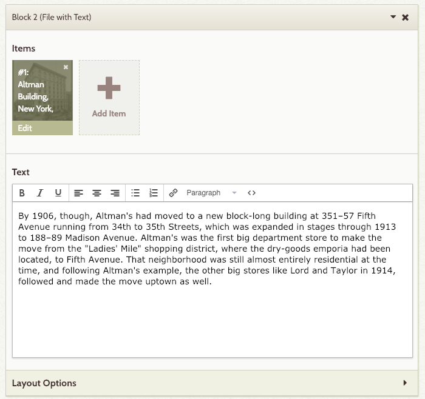

# Create an Exhibit

Exhibits are where the scholarly rubber hits the Internet road, as it were. Searchable “collections catalog” of their items VS capacity to build and publish “narrative exhibits.” Once you have built an Omeka archive with enough items, you can then use exhibits to interpret those items for the online public. Think of exhibits in a museum: a large museum may own 100,000 items, but at any one time only perhaps 1,000 of them are on display, and a single exhibit may have only 25 or so items. These items have been carefully chosen and arranged by curators, who also often write interpretive text for panels mounted on the wall and for the exhibit’s official catalog. You can also think of Omeka exhibits as multimedia essays created using the items in your archive. Many websites about scholarly or quasi-scholarly topics often decontextualize the images and documents they display, and the reader who wants to know where a particular image came from may be out of luck. This never happens with Omeka exhibits, because any item displayed in the exhibit can be clicked on, and the reader will be taken to the item record with its full complement of Dublin Core metadata. 

Example: http://coloredconventions.org/exhibits/show/henry-highland-garnet-address This exhibition makes use of both items in the database and external resources to tell the story of Henry Highland Garnet and his famous "An Address to the Slaves of the United States."

## Activate Plugin
To build an exhibition, we are first required to install the Exhibit Builder plugin. The Exhibit Builder plugin allows you to develop online exhibits, or special web pages, that combine items from your Omeka archive and may include narrative text. From your dashboard, access your _Plugin_ menu to activate it. 


## Create an Exhibit
Click on the _Exhibits_ link in the left menu. From there, click on _Add an Exhibit_. 


We’ll be prompted to enter the following information:

```
Title: Altman’s & Co. Before 1920.
Slug: altman-department-stores-before-1920
Credits: [Your Name]
Description: This exhibition explores the history of the main location of Altman's & Co. in the first two decades of the 1900s.
Tags: fifthavestore
```

A “slug” is the user friendly and URL valid name of a dynamic Omeka page. Most common usage of this feature is to create a permalink for each page. Omeka automatically generates post slugs from a post’s title, or we can tweak it according to our needs.  

Just like with items and collections, we can also set our exhibits as public/private and/or featured. Once you’ve entered the information, click on _Save Changes_. 


Exhibitions are also modular and Omeka allows us to create custom layouts for our exhibition pages. Now that we created our exhibition, let’s add a couple of sample pages to it.

## Add an Exhibit Page

We want our first page to provide a brief overview of Altman & Co's. Scroll to the bottom of your exhibit’s page and click on _Add Page_. After entering some basic information, such as a title, a link menu title (the text we want to appear in our exhibition menu), and a page slug, we’ll be able to fill the page with content from our database (and beyond). 


```
Page Title: The Golden Era of Department Stores
Menu Link Title: The Golden Era of Department Stores
Page Slug: 
```

Pages are made up of combinations of smaller content units called 'blocks.' There are four basic kinds of blocks: item(s) with text, an item gallery, text only, and file only. Each page can have one or more content blocks. 


The File with Text block allows you to pair fullsize or thumbnail files of your items with a block of text. The Gallery block creates a gallery of item files, generally large square thumbnails. You can add text to the gallery, which will display left or right of the gallery. The Text and Image blocks allow you to display an item or create a section of text which spans the width of the entire page. 

For our first block, select _File with Text_ and click on _Add New Content Block_. 

Click on _Add Item_ and select Altman & Co’s 1865 logo from our “Misc” collection. 



Our caption can be something like “Altman & Co’s first logo.” 


In the text box, we are going to provide a brief overview of Altman’s early days. 

> The store that would become B. Altman and Company began on Manhattan's Lower East Side as a family-owned store, which by 1865 had come to be solely owned by Benjamin Altman, one of the brothers in the family, and was located at Third Avenue and 10th Street. In 1877, the store, wanting to expand, relocated to 621 Sixth Avenue between 18th and 19th Streets. 
The second block is going to feature the Altman’s Fifth Avenue building. 

Click on _File with Text_, then _Add New Content Block_. 
Click on Add Item and select the 1906 picture from our “Buildings” collection. Our caption can be: "The building at 361 Fifth Avenue (at 34th Street)."



In the text box, we are going to narrate the story of the move to the building. 

> By 1906, though, Altman's had moved to a new block-long building at 351–57 Fifth Avenue running from 34th to 35th Streets, which was expanded in stages through 1913 to 188–89 Madison Avenue. Altman's was the first big department store to make the move from the "Ladies' Mile" shopping district, where the dry-goods emporia had been located, to Fifth Avenue. That neighborhood was still almost entirely residential at the time, and following Altman's example, the other big stores like Lord and Taylor in 1914, followed and made the move uptown as well.


The _Layout Options_ menu allows us to further customize the way our page looks. For example, we can select the position and size of the page. 


When you are done with this page, click on _Save Changes_. 

[<<< Back](collections.md) [Next >>>](whichomeka.md)  